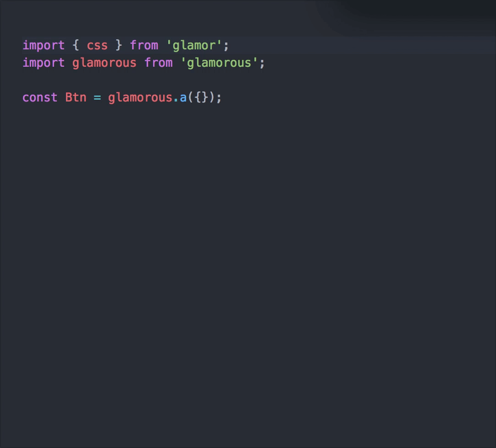
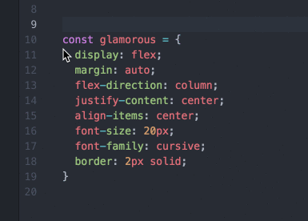

# Atom Plugin css-in-js

*WIP*

Now get Autocomplete for CSSinJS libraries using object styles.

```js
const btnA = css({ /* styles */ });
const btnB = glamorous.div({ /* styles */ });
const btnC = StyleSheet.create({ /* styles */ });
```
Only works for these keywords by default you can edit in settings for more.

`glamorous | css | StyleSheet.create`



Does not work for general objects
```js
let styles = {
  /* styles */
}
```
This is basically a fork of [autocomplete-css](https://github.com/atom/autocomplete-css)

`ctrl-alt-j` to convert the css lines to js


